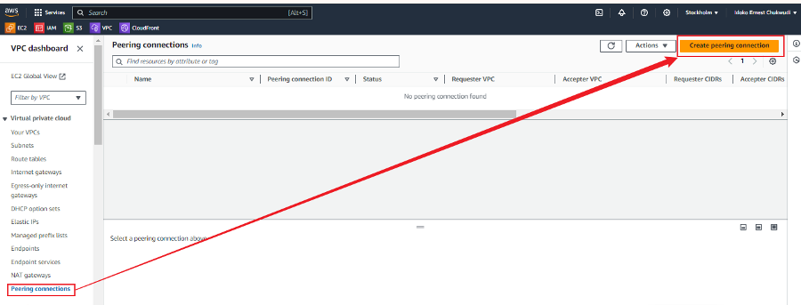
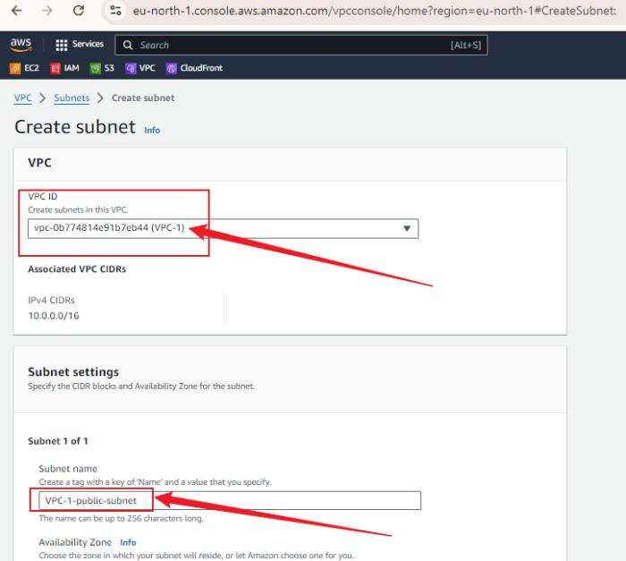
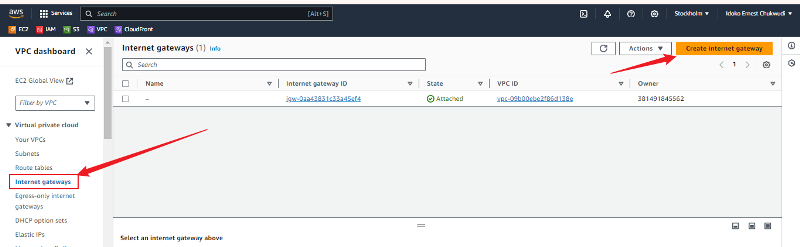

# VPC Peering with Security Group Configuration

## Purpose
This mini project demonstrates how to establish Virtual Private Cloud (VPC) peering connections between two Amazon VPCs using the AWS Management Console and configure security groups to allow traffic between instances in the peered VPCs.

## Objectives
Create Two VPCs
Initiate VPC Peering Connection
Accept VPC Peering Connection
Configure Security Groups
Verify Connectivity

## Task 1: Create Two VPCs
**1. Log in to the AWS Management Console.**

**2. Navigate to the VPC Dashboard:**
- Navigate to the VPC Dashboard by typing "VPC" into the search bar at the top of the AWS Management Console and selecting "VPC" from the search results.

**3. Create the first VPC (VPC-1):**
- Click the "Create VPC" button.

- Under "Resource to Create," select  `VPC only`

- Enter a name for your VPC (e.g., VPC-1).
- Set the IPv4 CIDR block to 10.0.0.0/16.
- Leave the default settings for other options.
- Click "Create VPC".

**3B: Create the Second VPC (VPC-2)**

- Repeat the process by clicking on "Create VPC".
- Enter the following details:
- Name: VPC-2
- IPv4 CIDR block: 10.1.0.0/16
- Click "Create VPC".

## Task 2: Initiate VPC Peering Connection
**1. Navigate to the Peering Connections:**
- In the VPC Dashboard, click on "Peering Connections" in the left-hand menu.

**2. Create a VPC Peering Connection:**
- Click the "Create Peering Connection" button.

- Under "Peering connection name tag", enter a name (e.g., VPC-1-to-VPC-2).
- For "Requester VPC", select VPC-1 from the drop-down menu.

- For "Accepter VPC", select VPC-2 from the drop-down menu.
- Click "Create Peering Connection".

**1. Navigate to the Peering Connections:**
- In the VPC Dashboard, click on "Peering Connections" in the left-hand menu.
- You should see the pending peering connection you just created. Select it.
- Click the "Actions" button, then click "Accept Request".

- Confirm by clicking "Accept request".

## Task 4: Create Subnets
**1. Create Subnets for VPC-1:**
- In the VPC Dashboard, click on "Subnets" in the left-hand menu.
- Click the "Create Subnet" button.

- Select VPC-1 from the drop-down menu.
- Enter a name for your subnet (e.g., VPC-1-public-subnet).

- Set the IPv4 CIDR block to 10.0.1.0/24.
- Select an Availability Zone (e.g., eu-north-1a).
- Click "Create Subnet".

**2. Create Subnets for VPC-2:**
- Repeat the process by clicking on "Create VPC".

Enter the following details:
- Select VPC-2 from the drop-down menu.
- Enter a name for your subnet (e.g., VPC-2-public-subnet).
- Set the IPv4 CIDR block to 10.1.0.0/24.
- Select an Availability Zone (e.g., eu-north-1a).
- Click "Create Subnet".

## Task 5: Configure Internet Gateway
**1. Create an Internet Gateway:**
- In the VPC Dashboard, click on "Internet Gateways" in the left-hand menu.
- Click the "Create Internet Gateway" button.

- Enter a name for your internet gateway (e.g., VPC-1-IGW).
- Click "Create Internet Gateway".

2. Attach Internet Gateway to VPC-1:
- Click the "Actions" button, then click "Attach to VPC".

- Select VPC-1 from the drop-down menu.
- Click "Attach Internet Gateway".

## Task 6: Create Route Tables
**1. Create Route Table for VPC-1:**
- In the VPC Dashboard, click on "Route Tables" in the left-hand menu.
- Click the "Create Route Table" button.

- Enter a name for your route table (e.g., VPC-1-RT).
- Select VPC-1 from the drop-down menu.
- Click "Create route table".

**2. Add Route for VPC-1:**
- Select the route table that is just created.
- Click on the "Routes" tab, then click "Edit routes".
- Click "Add route".
- Set "Destination" to 10.1.0.0/16 (CIDR block of VPC-2).
- Set "Target" to the VPC peering connection (pcx-xxxxx).

Update Route Table to Include Internet Gateway:
- Click "Add route."
- Set "Destination" to 0.0.0.0/0 (for all IPv4 traffic) or ::/0 (for all IPv6 traffic, if applicable).
- Set "Target" to the Internet Gateway (igw-xxxxx).
- Click "Save changes".

**3. Associate Route Table with Subnet for VPC-1:**
- Select the route table.
- Click on the "Subnet Associations" tab, then click "Edit subnet associations".

- Select the subnet you created earlier (VPC-1-public-subnet).
- Click "Save association".

**4. Create Route Table for VPC-2:**
- Repeat the process of creating a route table, but select `VPC-2` and name it `VPC-2-route-table`.

**5. Add Route for VPC-2:**
- Repeat the process of adding route, but select VPC-2, 
- Set "Destination" to 10.0.0.0/16 (CIDR block of VPC-1).
- Set "Target" to the VPC peering connection (pcx-xxxxx).
- Click "Save routes".

**6. Associate Route Table with Subnet for VPC-2:**
- Repeat the process of associating route table with Subnet for VPC-1
- Click on the "Subnet Associations" tab, then click "Edit subnet associations".
- Select the subnet you created earlier (VPC-2-public-subnet).
- Click "Save association".

## Task 7: Configure Security Groups
**1. Create Security Group for VPC-1:**
- In the VPC Dashboard, click on "Security Groups" in the left-hand menu.
- Click the "Create Security Group" button.

- Enter a name for your security group (e.g., VPC-1-sg).
- Select VPC-1 from the drop-down menu.

- Click "Create security group".

**2. Configure Inbound Rules for VPC-1 Security Group:**
- Select the security group you just created.
- Click on the "Inbound rules" tab, then click "Edit inbound rules".
- Click "Add rule".
- Set "Type" to "All Traffic".
- Set "Source" to the CIDR block of VPC-2 (10.1.0.0/16).
- Click "Save rules".

**3. Create Security Group for VPC-2:**
- Repeat the process of creating Security Group for VPC-1
- Click the "Create Security Group" button again.
- Enter a name for your security group (e.g., VPC-2-sg).
- Select VPC-2 from the drop-down menu.
- Click "Create".

**4. Configure Inbound Rules for VPC-2 Security Group:**
- Repeat the process of configuring VPC-1 Security Group:
- Select the security group you just created.
- Click on the "Inbound rules" tab, then click "Edit inbound rules".
- Click "Add rule".
- Set "Type" to "All Traffic".
- Set "Source" to the CIDR block of VPC-1 (10.0.0.0/16).
- Click "Save rules".

## Task 8: Create Instances
**1. Launch an EC2 Instance in VPC-1:**
- Navigate to the EC2 Dashboard.
- Click the "Launch Instance" button.

- Choose an AMI (e.g., ubuntu).

- In the "Configure Instance" section, select VPC-1 and the subnet VPC-1-public-subnet.
- In the "Configure Security Group" section, select "Choose existing security group" and select VPC-1-sg.
- Review and launch the instance.

**2. Launch an EC2 Instance in VPC-2:**
- Repeat the process of launching an EC2 instance, but select VPC-2 and the subnet VPC-2-public-subnet.
- In the "Configure Security Group" section, select "Choose existing security group" and select VPC-2-sg.

## Task 9: Verify Connectivity
**1. Connect to the EC2 Instance in VPC-1:**
- Obtain the public IP address of the EC2 instance in VPC-1 from the EC2 Dashboard.

- Use an SSH client to connect to the first instance:

- Run `exit` and Use an SSH client to connect to the second instance to test connectivity:

**2. Ping the EC2 Instance in VPC-2:**
- Run `exit` and Use an SSH client to connect to the first instance.
- Obtain the private IP address of the EC2 instance in VPC-2 from the EC2 Dashboard.
- From the SSH session of the VPC-1 instance, run:

The replies indicates successful communication between the instances in the peered VPCs.

## Conclusion and Reflection
**Significance of VPC Peering**

VPC peering is a crucial feature for interconnecting Amazon Virtual Private Clouds (VPCs) within the same AWS region or across different regions. The primary significance of VPC peering lies in its ability to enable secure and high-performance communication between instances in different VPCs. By setting up a VPC peering connection, organizations can facilitate data transfer between their VPCs as if they were within the same network, bypassing the need for a public internet connection or VPN. This enhances the security and performance of data communication, particularly for applications that require seamless inter-VPC interaction.

**Role of Security Groups**

Security groups play a vital role in controlling traffic between instances in peered VPCs. They act as virtual firewalls to manage inbound and outbound traffic to instances based on specified rules. In the context of VPC peering:

- **Inbound Rules:** By configuring security group rules to allow traffic from the CIDR block of the peered VPC, you ensure that instances in VPC-1 can accept connections from instances in VPC-2 and vice versa. This is essential for applications that span multiple VPCs but need to maintain a controlled and secure communication channel.

- **Outbound Rules:** Similarly, outbound rules determine what traffic can leave an instance and reach the peered VPC. Configuring these rules appropriately ensures that instances can communicate with their peers while adhering to security policies.

**Objectives and Additional Processes**

The primary objectives of the project were:
1. **Create Two VPCs:** Set up two VPCs to simulate a multi-VPC environment.
2. **Initiate and Accept VPC Peering Connection:** Establish a peering connection between the VPCs to enable inter-VPC communication.
3. **Configure Security Groups:** Set security group rules to allow traffic between instances in the peered VPCs.
4. **Verify Connectivity:** Test the communication between instances in the peered VPCs to ensure the setup is functional.

**Additional Processes Contributing to Success:**

1. **Subnet Creation:** Creating subnets within each VPC ensures that the instances are correctly segmented and can use routing tables to manage traffic efficiently.

2. **Internet Gateway Configuration:** Associating an internet gateway with VPC-1 allowed instances in VPC-1 to communicate with the outside world and facilitated connectivity testing.

3. **Route Tables:** Adding routes for the VPC peering connection in both VPCs' route tables was crucial for enabling traffic flow between the VPCs. Including routes for the internet gateway ensured that traffic could also flow to and from the internet as needed.

4. **Instance Launch and Configuration:** Launching and configuring EC2 instances in both VPCs provided a practical means to test and verify connectivity. Ensuring the correct security group associations and subnet configurations was key to the successful implementation of the peering connection.

By completing these additional steps, the project not only achieved its core objectives but also demonstrated the practical application of VPC peering and security group configurations in a real-world scenario.